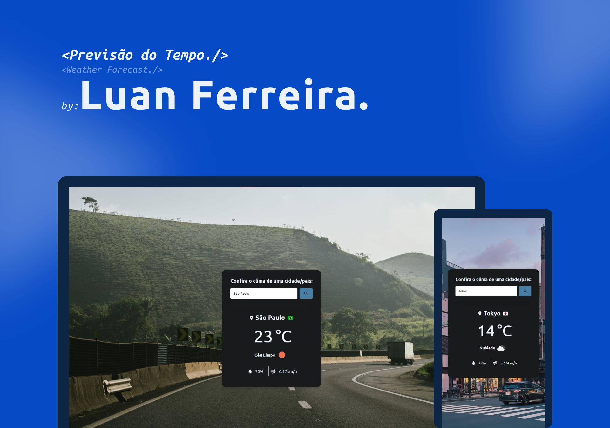

<h1 align="center"> Previsão do Tempo </h1>

  <a href="#-tecnologias">Tecnologias</a>&nbsp;&nbsp;&nbsp;|&nbsp;&nbsp;&nbsp;
  <a href="#-projeto">Projeto</a>&nbsp;&nbsp;&nbsp;|&nbsp;&nbsp;&nbsp;
  <a href="#memo-licença">Licença</a>

  

 

## 🚀 Tecnologias

Esse projeto foi desenvolvido com as seguintes tecnologias:

- HTML
- CSS
- JavaScript

## 💻 Projeto

Primeiro projeto consumindo APIs, com sistema de erro e 8 sujestões de cidades/países utilizando api OpenWather para trazer as condições climáticas de qualquer cidade/país do mundo.
API Coutry Flags para identificar a bandeira do páis da cidade escolhida e API Unsplash para trazer uma imagem de fundo relacionada com a cidade/país escolhido.

## 🖥️ [Veja o site no ar](https://rfluan.github.io/weatherforecast/)

## :memo: Licença

Esse projeto está sob a licença MIT.

---

Feito com ♥ by Luan Ferreira :wave:
